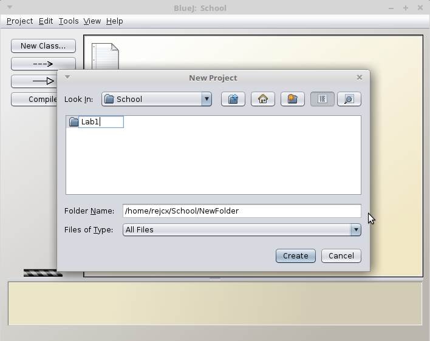
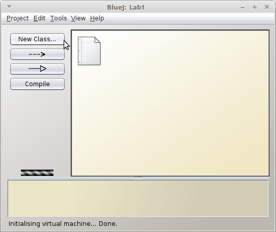
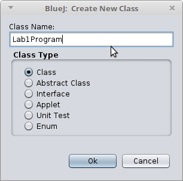
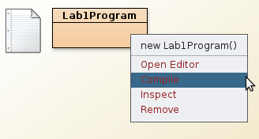
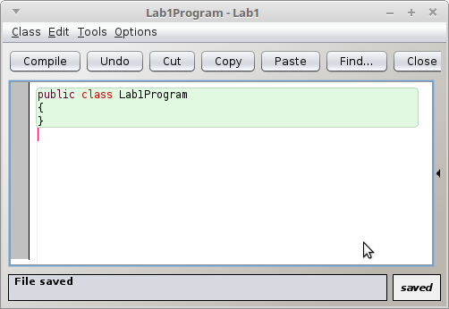
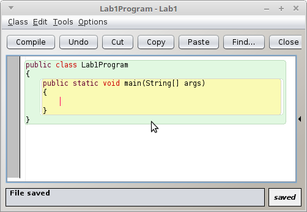
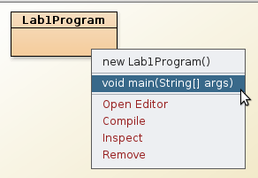
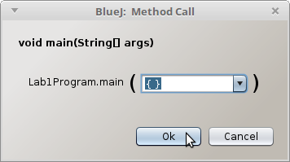
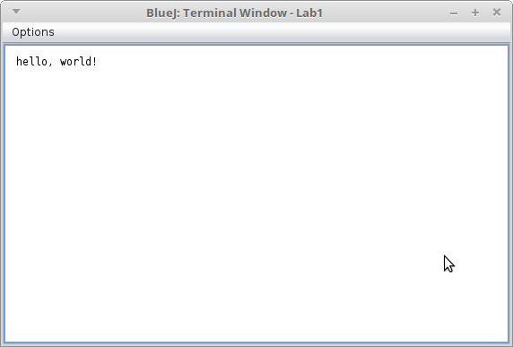

[Next: Variables and Data Types >>](01 Variables and Data Types.md)

---

# Using BlueJ

## Creating a simple Java project

In BlueJ, go to **File > New Project...**.

You will need to create a new folder for your project, and then click **Create**.

## Creating your program's Class file

Each program that you write will need a Class associated with it.
To create a new class, in BlueJ click on **New Class...**

Give the class a name, then hit **Ok**.

Right-click on the new class block, and select **Open Editor**.

It will have a bunch of pre-filled-in code that you don't need. Erase
all of it so that you only have your class declaration:

## Creating the entry-point function

In Java programs, the program will always begin at a **main()** function.

Add this function declaration to your class:

	public static void main(String[] args)
	{	
	}
	
Your core program will go in the main function. Your project should
look like this:

## Running the program

Once you have some code in your main function, click on **Compile**
from BlueJ. Once the program class doesn't have lines through it anymore,
it is ready.

Right-click on the class object and select your main() function.

Use the default parameters and hit **Ok**:

A terminal window will pop up with your program's output (if any):

---

# Using Eclipse

## Creating simple Java project

In Eclipse, it will ask you for a location for your workspace. The default is fine.

Go to **File > New > Project...**

Select Java Project

Give your project a name, and otherwise use default values. Click **Finish**.

## Viewing the Project

To the left side of the window, there should be a **Package Explorer**. You might have
to click an icon on the left side to get it to appear.

## Creating your program's Class file

After you create a project in Eclipse, you will need to create a **Class** in your project:

Set the **Name** of your class - usually this will describe your program, like "_____Program",
or an assignment name.

You can leave the defaults. Click **Finish** after you've selected a name.

Within this new class, you will create a **main** function, which will be the entry point of your program:

	public class MyProgram {
		public static void main(String[] args)
		{
			// Code goes here
		}
	}
	
This source file ends with **.java** after the class name, and this is the file
you can use to upload your work.

## Writing some sample code

Within your class, within your **main** method, add the following code:

	System.out.println( "Hello, world!" );
	
This is an output statement, and it will print text to the console.

## Running the program

Click on the green button with an arrow in it to run your program:

Your program will appear in the **console** window.

Our Java programs (input and output) will all be contained within the console.
